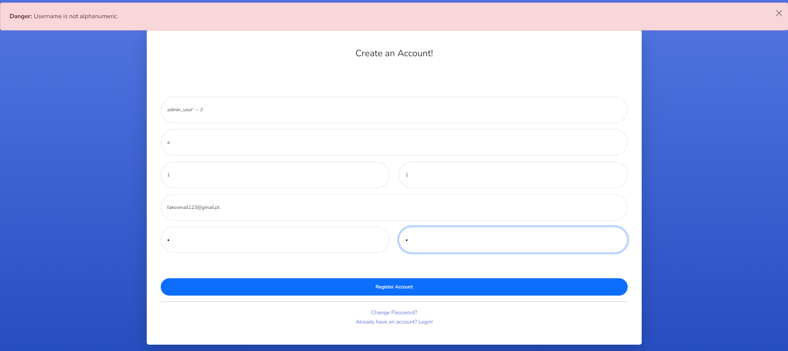
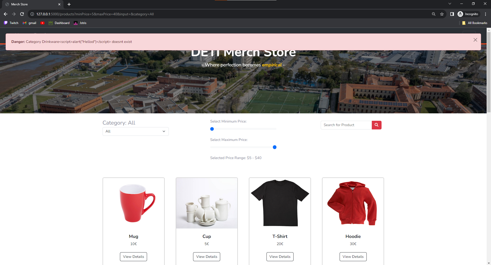
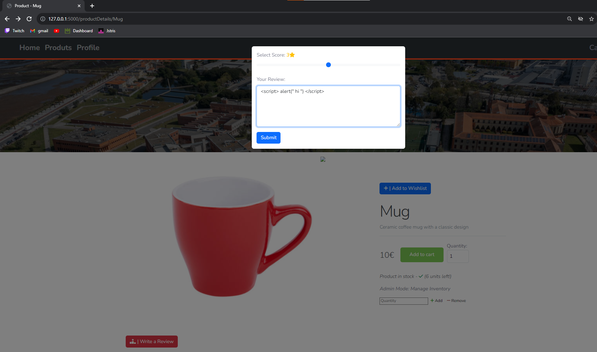
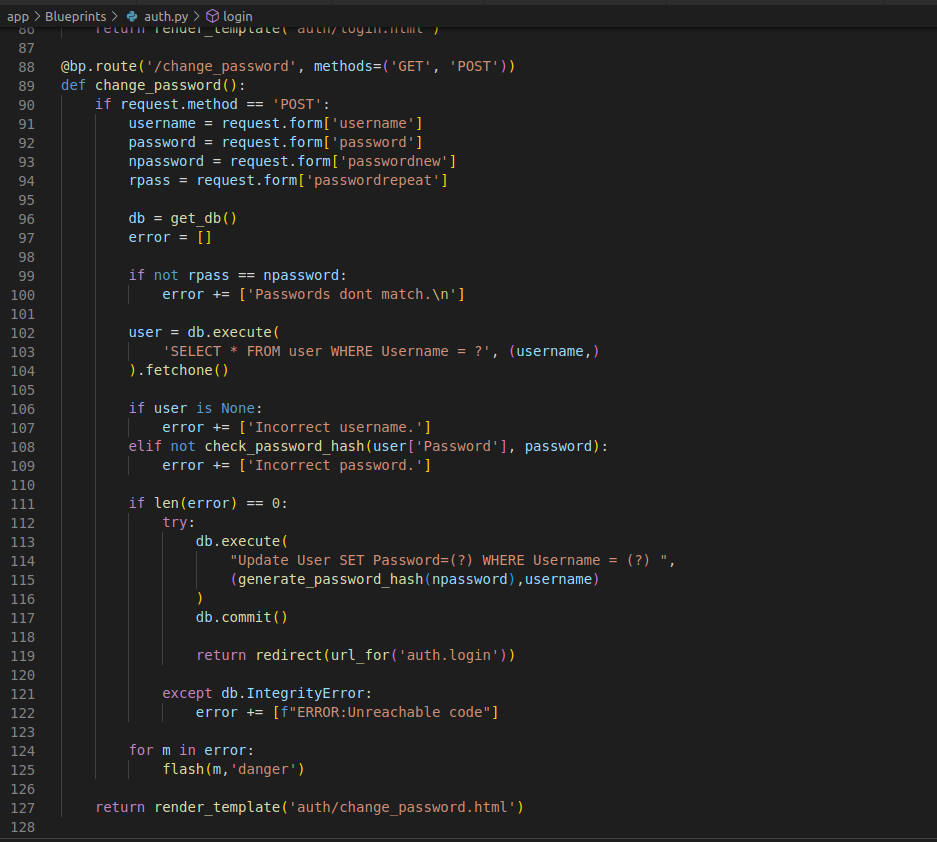
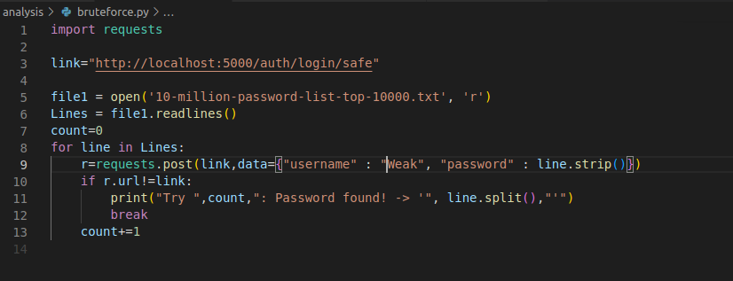
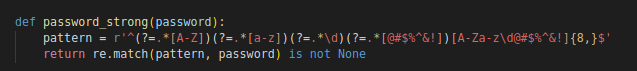
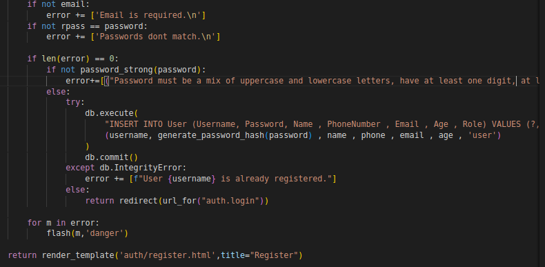
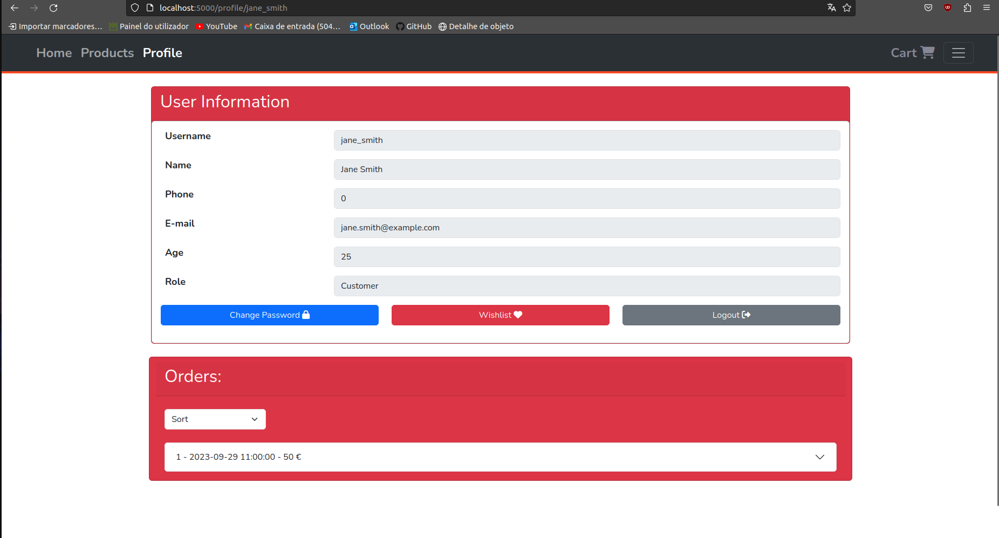
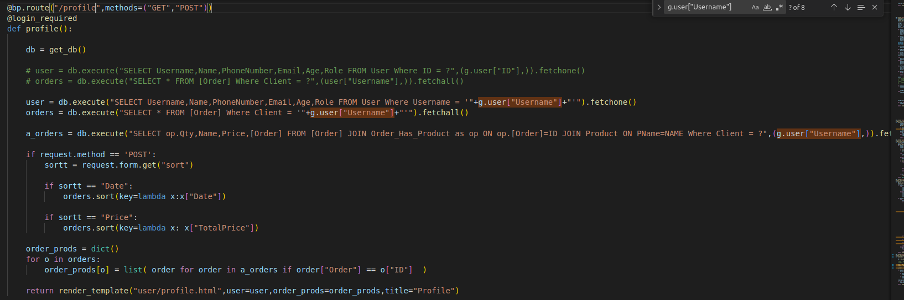
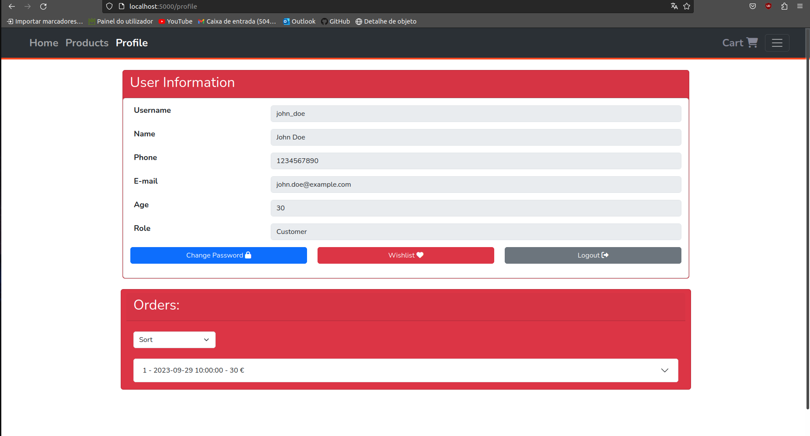

# SIOProject_1
Repository for SIO 2023/2024 1st Project

# Project Members

- **Diogo Marto   - 108298**
- **Tiago Pereira - 108546**

## Project Description

This project theme is "DETI memorabilia at the University of Aveiro". The aim is to develop a functional webstore with concealed vulnerabilities that are not apparent to casual users but can be exploited to compromise the system. As required, we present both a flawed and a corrected version of the shop, detailing how these vulnerabilities are explored and their impact.

## Explored CWE's

##      BaseImproper Neutralization of Special Elements used in an SQL Command ('SQL Injection')
##      Improper Neutralization of Input During  Web Page Generation ('Cross-site Scripting') 
##      Weak Authentication
##      Direct Request ('Forced Browsing')
##      Improper Neutralization of Special Elements Used in a Template Engine

# Installation

You need to have docker installed and the docker daemon running.
Inside the folders app or app_sec run the following command to create a docker image:

```
$ docker build -t [name_of_image] . 
```

Note you need to make this for both app and app_sec with differnt names for the image.

# Execution

You need to have docker installed and the docker daemon running.
Run the following command

```
$ docker run -p [desired_port_outside]:5000 [name_of_image]
```

Note make sure desired port is not being used and name of image is the ones created on Execution section.

## License

[MIT](https://choosealicense.com/licenses/mit/)

# Analysis CWE-89: SQL Injection

## Introduction 

SQL injection attacks represent a serious threat to any database-driven site.The methods behind an attack
are easy to learn and the damage caused can range from considerable to complete system compromise.

## Vulnerabilities 

### Basic Injection to Bypass Login 

#### Example

We have a simple login form on http://127.0.0.1:5000/auth/login and we also have an admin user called ```admin_user```. But this form is vulnerable to a simple sql injection.
By simply writing ``` admin_user'-- // ``` on the username and a random string for the password we can login to the admin account.


#### Weak code 


We are making the sql command based on string concatenation which allows to do a simple sql injection. ( Blueprints/auth.py login() function )

#### Fix 

- We can use a builtin functionality from the sqlite3 python library that allows us to build safe sql commands very simply.


- We can refactor the logic of our login so that it isnt vulnerable to this attack. In this example the ```check_password_hash()``` must always run and cant be skipped.


- We could also make an udf that would achieve the same thing that our functionality from sqlite3 , separation between arguments and the sql command.

### Basic injection on product listing to get names of all users

#### Example

We can search for products using a string but this field is vulnerable to sql injection.


```' ORDER BY 4 -- //```
We can check that is vulnerable by ordering the products in a different order also we can see that we can only order up to the 4th collumn.
After we know that we are working with 4 collumns we can add information to the product listing. For example with ```' UNION SELECT 1,2,3,4,5 -- // ```


But we can cause a bit more damage with ```' UNION SELECT  Username , ID , Password , Role FROM User ORDER BY 2 -- //```


Which gives us a list of the username and the corresponding encrypted password.

#### Weak code


Once again we are building our SQL commands using concatenation of strings. ( Blueprints/shop.py products() function ) 

#### Fix 

- We can deploy a similar strategy used above and use the sqlite3 python functionality to prevent SQL injection.


### SQL Second order attacks

#### Example

When register our Username can be anything due to that we can store an unsanitized piece of SQL. Like ``` admin_user' -- // ```


Now we can login into this new account , but funnily enough since our login is vulnerable to SQL injections we cant even login to this account since instead it will login to the ```admin_user```.
So we have a route ```auth/login/safe``` that doesnt have SQL injection we can login to ``` admin_user' -- // ```


Now if we go to the profile we will see something interesting.


We see the profile of the ```admin_user``` !

#### Weak code


On Blueprints/shop.py on the function profile() we have this segment of code. On ```g.user``` its stored our current session that as all the some details about the user namely ```Username```.
When we store an unsanitized piece of SQL in ```Username``` the resulting SQL command built from concatenation will be unsafe in our case will give us the profile for the ```admin_user```.

#### Fix

- We can once again use the builtin functionality from the sqlite3 python library that allows us to build safe sql commands and even if the ```Username``` is unsafe it still be treated in a manner thats safe. In the same vein we can build the SQL based on something the user doesnt have control namely ```ID``` which is generated by the database.
  


- Another fix is proper validation of what we store, in our case what we store on ```Username```. We can assume that ```Username``` can only be alphanumeric for example.


On Blueprints/auth.py register() function



### Blind Injection

#### Example 

We can search for products using a string but this field is vulnerable to sql injection.


We can see that products will only appear when on ```' AND TEST -- // ``` the ```TEST``` is true. 
For example we can use ```' AND ( select COUNT(*) from User ) > NUM  -- //``` to see if the number of users is superior to ```NUM```
And by doing some queries we can find exact amount.
- ```' AND ( select COUNT(*) from User ) > 50  -- //``` is False.
- ```' AND ( select COUNT(*) from User ) > 25  -- //``` is False.
- ```' AND ( select COUNT(*) from User ) > 12  -- //``` is True.
- ```' AND ( select COUNT(*) from User ) > 18  -- //``` is True.
- ```' AND ( select COUNT(*) from User ) > 21  -- //``` is False.
- ```' AND ( select COUNT(*) from User ) > 20  -- //``` is True.
So we get that we have 21 users.

#### Weak code


Once again we are building our SQL commands using concatenation of strings. ( Blueprints/shop.py products() function ) 

#### Fix 

- We can deploy a similar strategy used above and use the sqlite3 python functionality to prevent SQL injection.


# Analysis CWE-79: XSS

## Introduction
XSS attacks exploit vulnerabilities within Web interactions where an attacker performs indirect actions
against Web clients through a vulnerable Web application. The primary result is that some external code is
injected into the victim’s web browser and will be executed. All existing context, including valid cookies, as
well as computational resources of the victim become available to the attacker.

## Vulnerabilities 

### Reflected XSS Attack

#### Example
We can search for products based on a url , i.e http://127.0.0.1:5000/products?minPrice=5&maxPrice=40&input=&category=Drinkware . 
But we can exploit this to do a reflected XSS attack , the field of category is rendered on the page by changing it we can inject unwanted code in the website.

This link, http://127.0.0.1:5000/products?minPrice=5&maxPrice=40&input=&category=Drinkware%3Cscript%3Ealert(%22Hellod%22)%3C/script%3E is compromised
when the page loads it shows and a popup saying "Hello". 


#### Weak code


In this piece of code we assume that category is safe so it can be treated has html. ( templates/products.html )

Also on the function products() on Blueprints/shop.py we never validate if the category field is an existing one or if it just garbage.

#### Fix 

- If we omit the safe tag jinga2 ( our template engine ) will assume that the input is unsafe and only treat it has text.


- If we validate if the category exists we can on the server indicate correct steps to fix the problem.





### Stored XSS Attack

#### Example

We can write reviews for a product.


But we can insert a malicious payload in the review that will then be stored on the server. Users then accessing this webpage will render the malicious payload.



After we load the page again we get:


#### Weak code


We assume that the review is safe so the contents of it are treated like html.

Also we dont check on the server side if the review migth have malicious code.

#### Fix 

- Just omit the safe tag and the review will only be treated as text.


- We could also parse the review and check if it has any potencial malicous payload and reject it but for our case we assumed that the review is only text so this is uneccesary and just removing the safe tag is enough.

###  CSRF Attack

#### Example


We can also target different servers using an XSS attack in this example we use the image tag to make a request to a server with the credentials of a user who visits the page with the malicious review.


As we can see a GET request to ```https://vulnerable-bank.com/transfer.jsp?amount=1000&to_nib=12345300033233``` was sent and a normal user migth have been unware of this.

#### Fix 

- Don´t allow stored XSS Attack and reflected XSS Attack with the strategies diccussed above.

- Enable CORS or a secure Content Security Policy so that the browser knows what to not load.


# Analysis CWE-1390: Weak Authentication

## Introduction
It's common for users to prefer the definition and use of weak password, i.e., sequences, common words, etc... Why is that? It's pratical and easy to remember. But that provides a perfect environment for credentials theft, as it is easy to break those credentials
with a simple approach... Brute force.

## Vulnerability code:

In auth.py, when we handle the definition and change of a password, no verification to its complexity is being made, allowing for the insertion of weak passwords.



## Exploit

Consider the following simple script in python, present in the bruteforce.py file:


**Note:** We are using a github document, stored in "10-million-password-list-top-10000.txt"(obtained from: https://github.com/danielmiessler/SecLists/blob/master/Passwords/Common-Credentials/10-million-password-list-top-1000000.txt)

We have a user called Weak. He uses a very basic password. Through brute force, fetching from a common password database we we're able to find it's password. It was "potato":


## Solution?

To solve this problem we can take a very simple approach. Enforce strong passwords through password validation. To achieve this, we created a function that checks if the password is acceptable according to the following requirements:
 **-> have a mix of uppercase and lowercase letters**
 **-> have at least one digit**
 **-> have at least one special character**
 **-> have a minimum length of 8 characters**

**Secure Code:**

We validate:


And act accordingly:


# Analysis CWE-425:Forced Browsing

## Introduction
Imagine being able to access classified information without the necessary credentials with the excuse of "I want to!". As naive as it sounds, thats precisely what Forced Browsing stands for. It envolves manipulating front-end elements to access whats not supposed to be accessed.

## Vulnerability code:

In shop.py when we handle the profile route, we consider the username as input parameter passed through the URL. That allows the external world to manipulate and forge a fake identity, accessing other users sensible information(such as billing).


## Exploit

We can manage the URL to access the information about whoever we want to. Username information can be obtained through other methods, such as fishing and pool of common usernames. Some examples of this exploit:



We have done it all without the need of any type of authentication!

## Solution?

To solve this problem we can take a very simple approach. Pass the username variable, which is constant through a session as as internalized variable, not allowing front-end manipulation of sensible data accessors.

**Secure Code:**

We use the internal variable g.user["Username"]:


And the URL has no longer the name parameter:


# Analysis CWE-1336: Improper Neutralization of Special Elements Used in a Template Engine

## Introduction 
Many web applications use template engines that allow developers to insert externally-influenced values into free text or messages in order to generate a full web page, document, message, etc. Such engines include Twig, Jinja2, Pug, Java Server Pages, FreeMarker, Velocity, ColdFusion, Smarty, and many others - including PHP itself. Some CMS (Content Management Systems) also use templates.

Template engines often have their own custom command or expression language. If an attacker can influence input into a template before it is processed, then the attacker can invoke arbitrary expressions, i.e. perform injection attacks. For example, in some template languages, an attacker could inject the expression "{{7*7}}" and determine if the output returns "49" instead. The syntax varies depending on the language.

We our case we are using Jinja2 to generate this templates.

## Example

We can search for products based on a url , i.e ```http://127.0.0.1:5000/products?minPrice=5&maxPrice=40&input=&category=Drinkware``` . But we can exploit this since our category field is vulnerable to SSTi.
The link ```http://127.0.0.1:5000/products?minPrice=5&maxPrice=40&input=&category={{2*2}}``` returns the following result.


As we can see the category is 4 the result of 2*2. But this raises the question who did this calculation and why? The answer is that the server did , so that means that we are executing code on the server and the server ran the code for the calculation because ```{{ }}``` signals to Jinga2 to render something that it in our case the result of 2\*2.
If we try the link ```http://127.0.0.1:5000/products?minPrice=5&maxPrice=40&input=&category={{print("Hi")}}``` we will see something curious.


This error is the result of the template engine running in a sandbox where we cant do function calls directly i.e we cant do ```print("Hi")```.
So what do we have access to? We at least have access to numbers as we show above , but also strings , list , dict , tuple , some variables like config , request .

```http://127.0.0.1:5000/products?minPrice=5&maxPrice=40&input=&category={{%20config%20}}``` returns the following result.


In here we have access to something we probably shouldnt have, namely 'SECRET_KEY': 'dev'.

```http://127.0.0.1:5000/products?minPrice=5&maxPrice=40&input=&category={{%20dict.__base__.__subclasses__()%20}}``` returns the following result.


What happened here is that we are running this piece of code ```dict.__base__.__subclasses__()```. ```dict``` is a class and ```dict.__base__``` returns the base class of ```dict``` which is ```Object```. Then we basicly do ```Object.subclasses()``` which returns a list of all classes ( since all classes come from the ```Object``` class). And this has give us the opportunity to access hundreds of new classes and functions in those classes , and have some fun with them. ```{{dict.__base__.__subclasses__()[351]}}``` is gonna give us ```<class 'subprocess.Popen'>``` which spawn some process. ( the index to find this class may vary )

```http://127.0.0.1:5000/products?minPrice=5&maxPrice=40&input=&category={{dict.__base__.__subclasses__()[351](%22ls%20%22,shell=True,stdout=-1).communicate()[0].strip()}}```

Lists the file on the directory with ```ls```.


```http://127.0.0.1:5000/products?minPrice=5&maxPrice=40&input=&category={{dict.__base__.__subclasses__()[351](%22cat%20__init__.py%22,shell=True,stdout=-1).communicate()[0].strip()}}```

Shows the contents of ```__init__.py``` which is source code of our website.


At this point we have access to ```bash``` commands and we can go some damage to the server.

## Weak code


On this line we are calling rendering on category as a template but we never check if category is safe to render().

## Fix 

- Category shouldnt be rendered as a template it should be only treated as text to inject in some template, never a template.


- If we really need to render Category has a template we could also validade that category is something safe to render. 


