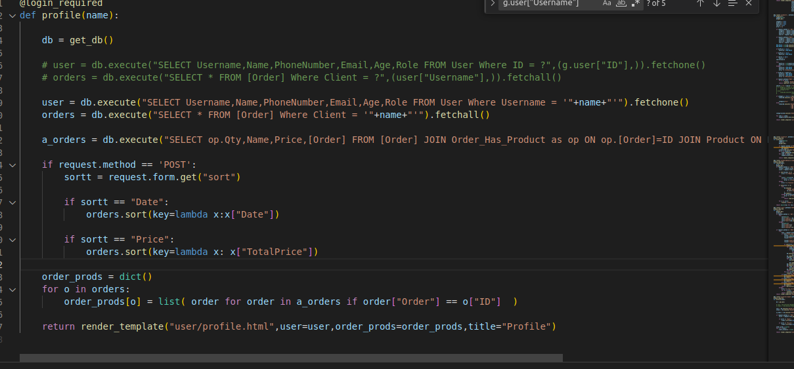
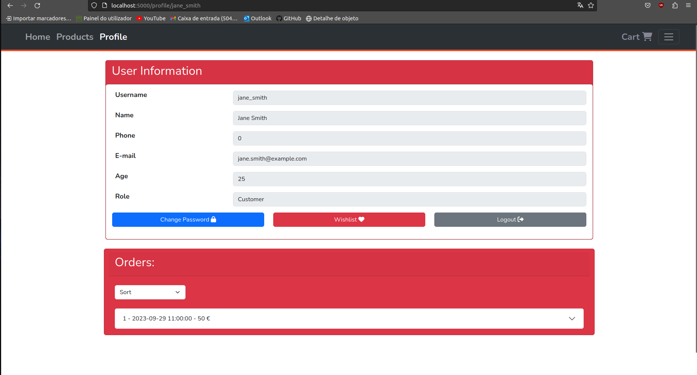
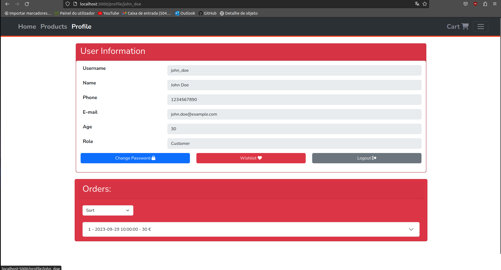
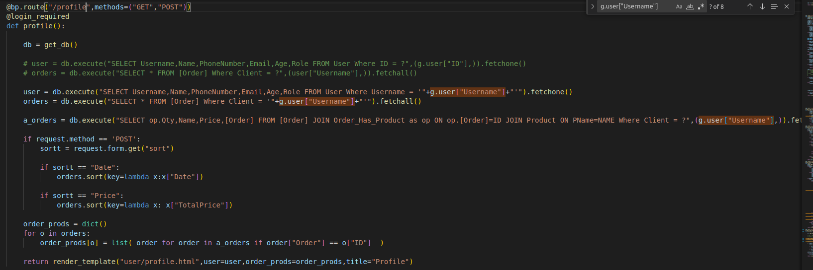
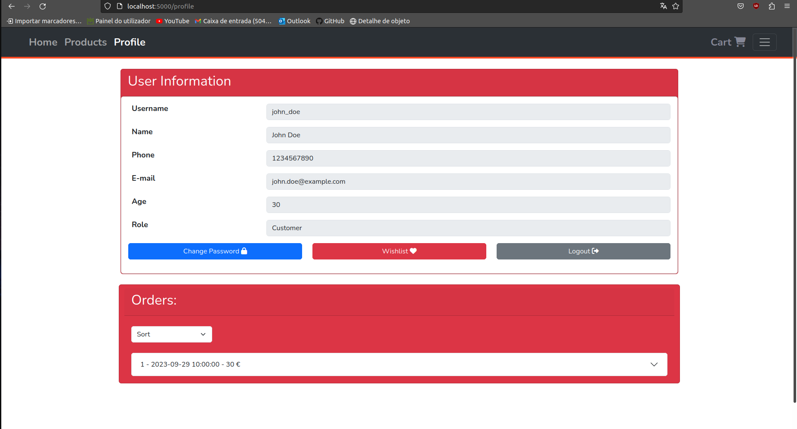

# Analysis CWE-425:Forced Browsing

## Introduction
Imagine being able to access classified information without the necessary credentials with the excuse of "I want to!". As naive as it sounds, thats precisely what Forced Browsing stands for. It envolves manipulating front-end elements to access whats not supposed to be accessed.

## Vulnerability code:

In shop.py when we handle the profile route, we consider the username as input parameter passed through the URL. That allows the external world to manipulate and forge a fake identity, accessing other users sensible information(such as billing).

## Exploit

We can manage the URL to access the information about whoever we want to. Username information can be obtained through other methods, such as fishing and pool of common usernames. Some examples of this exploit:

We have done it all without the need of any type of authentication!

## Solution?

To solve this problem we can take a very simple approach. Pass the username variable, which is constant through a session as as internalized variable, not allowing front-end manipulation of sensible data accessors.

**Secure Code:**

We use the internal variable g.user["Username"]:

And the URL has no longer the name parameter:

    