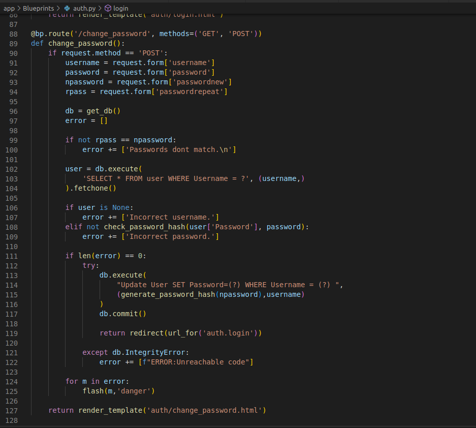
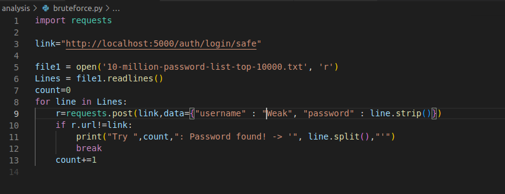
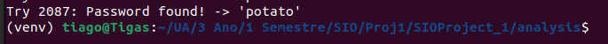
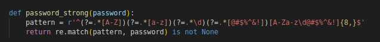
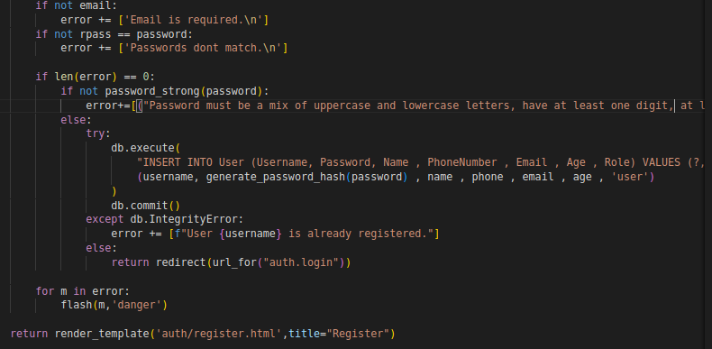

# Analysis CWE-1390: CWE-1390: Weak Authentication

## Introduction
It's common for users to prefer the definition and use of weak password, i.e., sequences, common words, etc... Why is that? It's pratical and easy to remember. But that provides a perfect environment for credentials theft, as it is easy to break those credentials
with a simple approach... Brute force.

## Vulnerability code:

In auth.py, when we handle the definition and change of a password, no verification to its complexity is being made, allowing for the insertion of weak passwords.

## Exploit

Consider the following simple script in python, present in the bruteforce.py file:

**Note:** We are using a github document, stored in "10-million-password-list-top-10000.txt"(obtained from: https://github.com/danielmiessler/SecLists/blob/master/Passwords/Common-Credentials/10-million-password-list-top-1000000.txt)

We have a user called Weak. He uses a very basic password. Through brute force, fetching from a common password database we we're able to find it's password. It was "potato":

## Solution?

To solve this problem we can take a very simple approach. Enforce strong passwords through password validation. To achieve this, we created a function that checks if the password is acceptable according to the following requirements:
 **-> have a mix of uppercase and lowercase letters**
 **-> have at least one digit**
 **-> have at least one special character**
 **-> have a minimum length of 8 characters**

**Secure Code:**

We validate:

And act accordingly:

    